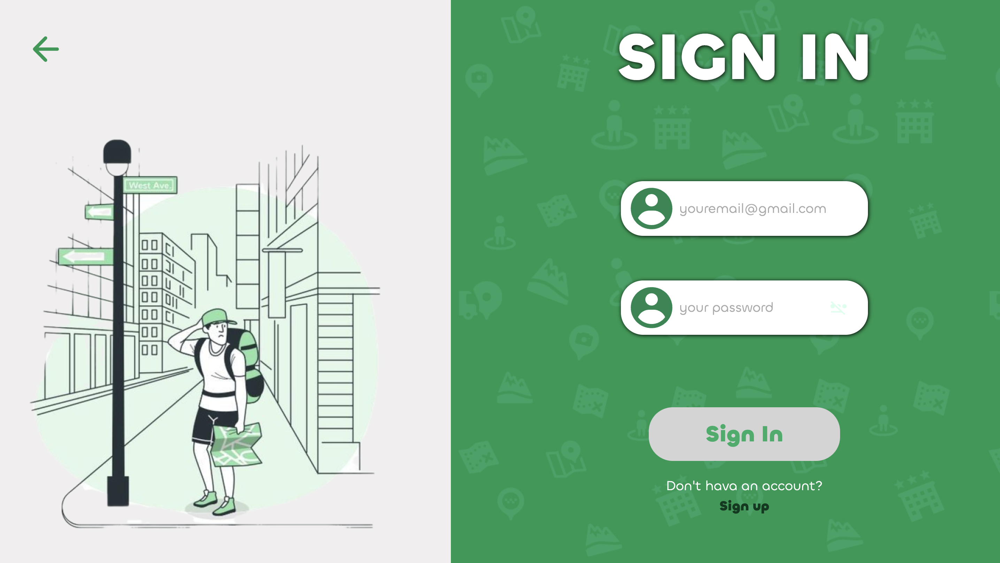
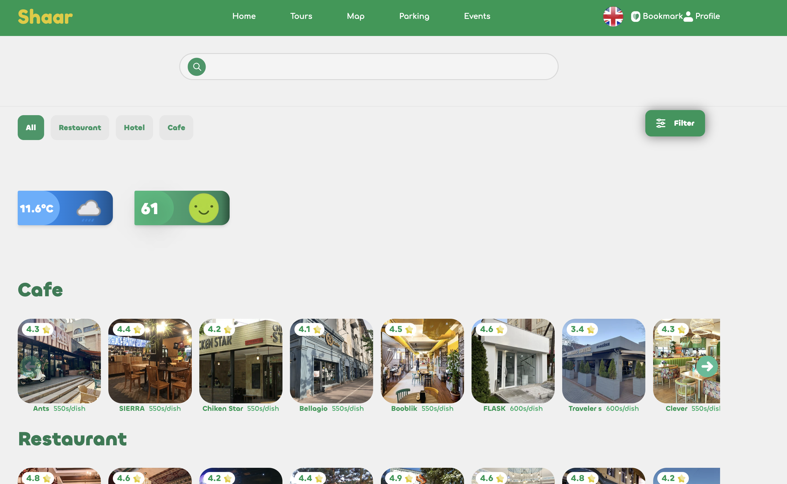
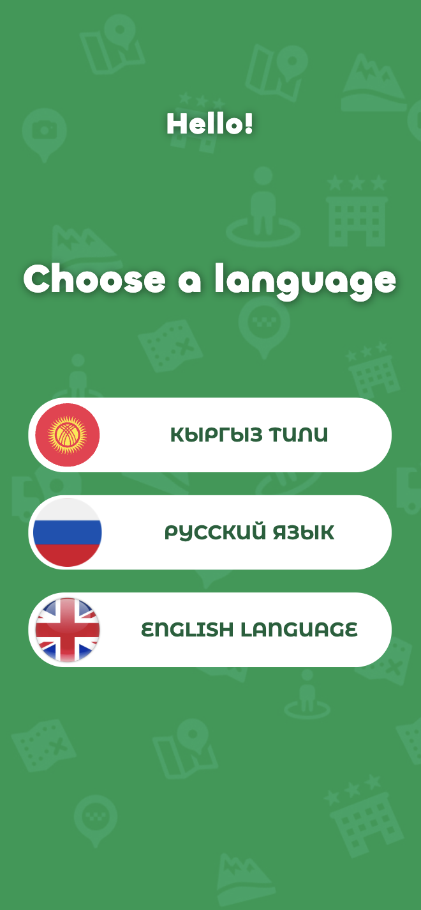

# Shaar
Перейти на сайт Shaar: https://shaar-tau.vercel.app/welcome

Бэкэнд : https://github.com/daniarmakyev/ShaarBackCleanArch

Веб-приложение, направленное на улучшение туристического опыта в Бишкеке с использованием современных технологий фронтенд-разработки и интеграции с Google Maps API.

Сайт был разработан за 24 часа в рамках хакатона на мероприятии **IT-Fest** в Бишкеке, организованном мэрией с целью развития молодежи города, включая студентов университетов и колледжей.

---

## Основные зоны проекта

### 1. Туристические маршруты
  
  

**Описание:**  
- Построение кастомных маршрутов на основе туров.
- Отображение ключевых точек маршрута с полным описанием (время, дистанция, описание).
- Интеграция поиска Google Maps.  

---

### 2. Парковки
  

**Описание:**  
- Карты с зонами парковки, обозначенными зелёными полигонами.
- Метки на парковках с информацией о стоимости, дистанции и возможностью построить маршрут.
- **Конструктор парковок**: возможность вручную создавать собственные парковочные зоны, рисовать полигоны и добавлять метки без кода.  

---

### 3. События
  

**Описание:**  
- Страница с календарём ближайших мероприятий в Бишкеке.  
- Интерактивный интерфейс для просмотра и фильтрации событий (функционал в разработке).  

---

### 4. Конструктор парковок
   

**Описание:**  
- Полностью интерактивный инструмент для добавления новых зон парковки.
- Рисование полигонов вручную прямо на карте.
- Добавление пользовательских меток с детальной информацией.  

---

### 5. Регистрация и авторизация
    
 

Для использования функционала приложения предусмотрены следующие возможности регистрации и логина:

- **JWT Токены** используются для авторизации пользователей.
- Процесс регистрации:
  - Пользователь создаёт аккаунт с помощью email и пароля.
  - После успешной регистрации на сервер отправляется запрос для генерации JWT токена.
- Процесс логина:
  - Пользователь вводит email и пароль.
  - Сервер отправляет JWT токен, который сохраняется в **localStorage**.
  - Этот токен используется для аутентификации на всех последующих запросах.

---

## Технологии и функционал

Приложение построено на **React** с использованием **TypeScript**. Карты реализованы через Google Maps API и визуализированы с помощью **@vis.gl/react-google-maps**. Используются библиотеки для управления состоянием, мультиязычности и работы с запросами.

### Основные зависимости:
- **Google Maps API**
- **Tailwind CSS**
- **React Hook Form**
- **Framer Motion**
- **JWT (JSON Web Tokens)** для аутентификации и авторизации пользователей

## Галерея

Здесь представлены фотографии и скриншоты, иллюстрирующие функционал и дизайн нашего проекта.

### Боковое меню / навигация

### Главное меню
  

### Страница привествия /welcome

